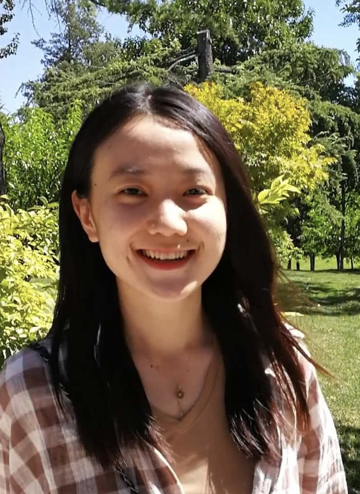

&nbsp;&nbsp;&nbsp;&nbsp;&nbsp;&nbsp;<strong>Meng Jin</strong>  

&nbsp;&nbsp;&nbsp;&nbsp;&nbsp;&nbsp;<strong>Assistant Professor</strong>  

&nbsp;&nbsp;&nbsp;&nbsp;&nbsp;&nbsp;<strong>John Hopcroft Center for Computer Science</strong>  
&nbsp;&nbsp;&nbsp;&nbsp;&nbsp;&nbsp;<strong>Shanghai Jiao Tong University</strong>  

&nbsp;&nbsp;&nbsp;&nbsp;&nbsp;&nbsp;<strong>Contact</strong>:  
&nbsp;&nbsp;&nbsp;&nbsp;&nbsp;&nbsp;SEIEE Bldg, 1-437, Shanghai Jiao Tong University, 800 Dongchuan Rd., Shanghai  
&nbsp;&nbsp;&nbsp;&nbsp;&nbsp;&nbsp;jinm@sjtu.edu.cn  

## About me:

I am an Assistant Professor and Ph.D. supervisor at John Hopcroft Center for Computer Science of Shanghai Jiao Tong University since February 2021. During 2018.07-2021.01, I was a postdoctoral researcher at Tsinghua University. I obtained my Ph.D., master's, and B.E. degree in the School of Information Science and Technology from Northwest university in 2018, 2015, and 2012.

## Prospective Students:

I am always looking for self-motivated students who are interested in pursuing a master's or Ph.D. degrees in the broad areas of IoT, wireless communication, and ubiquitous computing. Please send me an email if you are interested.

## Research Interest:

Wireless communication: Backscatter communication: Wireless coexistence 
Ubiquitous computing: Wireless sensing; RFID systems; Wearable sensing

## Awards:

2019 ACM China Doctoral Dissertation Award (2019 ACM中国优秀优秀博士论文奖)
2019 CCF Outstanding Doctoral Dissertation Award (2019 CCF优秀优秀博士论文奖)

## Selected Publications:

### Journal:  

1.Meng Jin, Yuan He, Chengkun Jiang, Yunhao Liu, Parallel Backscatter: Channel Estimation and Beyond, IEEE/ACM Transactions on Networking, 2021 (ToN, CCF-A). 

2.Meng Jin, Yuan He, Xiaolong Zheng, Dingyi Fang, Dan Xu, Tianzhang Xing, Xiaojiang Chen, “Exploiting Interference Fingerprints for Predictable Wireless Concurrency”, IEEE Transections on Mobile Computing (TMC, CCF-A).  

3.Meng Jin, Yuan He, Xin Meng, Yilun Zheng, Dingyi Fang, Xiaojiang Chen, “FlipTracer: Practical Parallel Decoding for Backscatter Communication”, IEEE Transections on Networking (TON, CCF-A).  

4.Meng Jin, Yuan He, Dingyi Fang, Xiaojiang Chen, Xin Meng, Tianzhang Xing, “iGuard: A Real-Time Anti-Theft System for Smartphones”, IEEE Transections on Mobile Computing (TMC, CCF-A).  

5.Meng Jin, Yuan He, Xin Meng, DingyiFang, Xiaojiang Chen, “Parallel Backscatter in the Wild: When Burstiness and Randomness Play with You”, IEEE Transections on Networking (TON, CCF-A).  

6.Yuan He, Yilun Zheng, Meng Jin, Songzhen Yang, Xiaolong Zheng, Yunhao Liu, “RED: RFID-based Eccentricity Detecti1on for High-speed Rotating Machinery” , IEEE Transections on Mobile Computing (TMC, CCF-A).  

### Conference:  

1.Meng Jin, Yuan He, Xin Meng, Dingyi Fang, Xiaojiang Chen, "Parallel Backscatter in the Wild: When Burstiness and Randomness Play with You", ACM MobiCom 2018 (CCF-A)  

2.Meng Jin, Yuan He, Xin Meng, Yilun Zheng, Dingyi Fang, Xiaojiang Chen, "FlipTracer: Practical Parallel Decoding for Backscatter Communication", ACM MobiCom 2017 (CCF-A).  

3.Meng Jin, Yuan He, Dingyi Fang, Xiaojiang Chen, Xin Meng, Tianzhang Xing, “iGuard: A Real-Time Anti-Theft System for Smartphones”, IEEE INFOCOM 2017 (CCF-A).  

4.Meng Jin, Tianzhang Xing, Xiaojiang Chen, Xin Meng, Dingyi Fang, Yuan He, "DualSync: Taming Clock Skew Variation for Synchronization in Low-Power Wireless Networks", IEEE INFOCOM 2016 (CCF-A).  

5.Meng Jin, Yuan He, Chengkun Jiang, Yunhao Liu, "Fireworks: Channel Estimation of Parallel Backscatered Signals ", IEEE/ACM IPSN 2020 (CCF-B).  

6.Meng Jin, Yuan He, Xiaolong Zheng, Dingyi Fang, Dan Xu, Tianzhang Xing, Xiaojiang Chen, “Smoggy-Link: Fingerprinting Interference for Predictable Wireless Concurrency”, IEEE ICNP 2016 (CCF-B).  

7.Junchen Guo, Meng Jin, Yuan He, Yunhao Liu, “Dancing Waltz with Ghosts: Measuring Sub-mm-Level 2D Rotor Orbit with a Single mmWave Radar", IEEE/ACM IPSN 2021 (CCF-B).  

8.Chengkun Jiang, Junchen Guo, Yuan He, Meng Jin, Shuai Li, Yunhao Liu, “mmVib: Micrometer-Level Vibration Measurement with mmWave Radar”, ACM MobiCom 2020 (CCF-A).  

9.Chengkun Jiang, Yuan He, Meng Jin, Xiaolong Zheng, Junchen Guo, "Canon: Exploiting Channel Diversity for Reliable Parallel Decoding in Backscatter Communication", IEEE ICNP 2018 (CCF-B).  

10.Junchen Guo, Ting Wang, Yuan He, Meng Jin, Chengkun Jiang, Yunhao Liu, "TwinLeak: RFID-based Liquid Leakage Detection in Industrial Environments", IEEE INFOCOM 2019 (CCF-A).  

11.Yilun Zheng, Yuan He, Meng Jin, Xiaolong Zheng, Yunhao Liu, "RED: RFID-based Eccentricity Detection for High-speed Rotating Machinery", IEEE INFOCOM 2018 (CCF-A)

## Grants:

Principal Investigator: National Natural Science Foundation of China, No. 61902213, Parallel Decoding for Backscatter Communication (面向无源感知网络的并发后向散射技术研究), 2020.01-2022.12.
