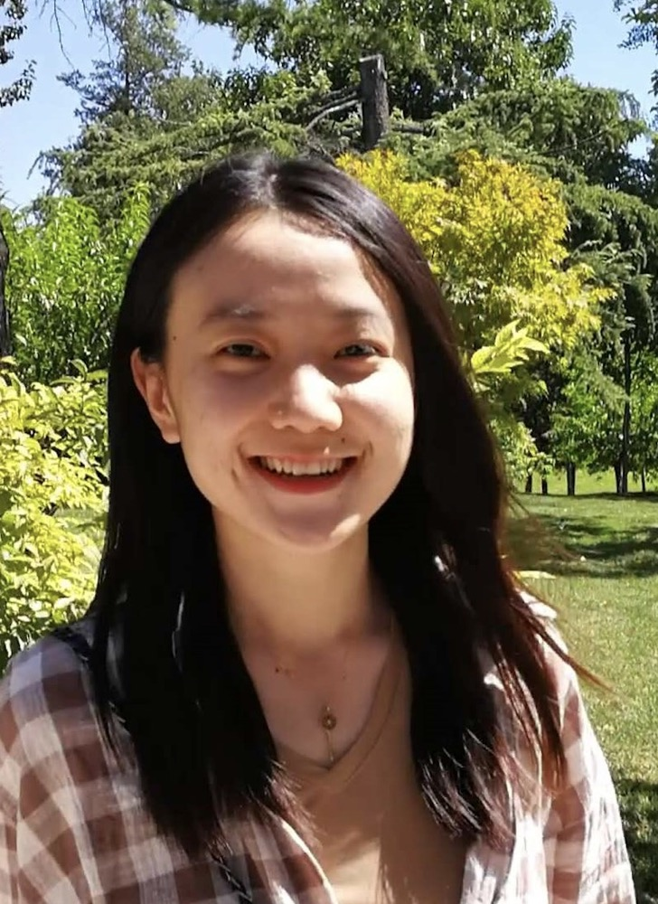

&nbsp;&nbsp;&nbsp;&nbsp;&nbsp;&nbsp;<strong>Meng Jin</strong>   

&nbsp;&nbsp;&nbsp;&nbsp;&nbsp;&nbsp;<strong>Professor</strong>  

&nbsp;&nbsp;&nbsp;&nbsp;&nbsp;&nbsp;<strong>School of Artificial Intelligence</strong>  
&nbsp;&nbsp;&nbsp;&nbsp;&nbsp;&nbsp;<strong>Shanghai Jiao Tong University</strong>  

&nbsp;&nbsp;&nbsp;&nbsp;&nbsp;&nbsp;<strong>Contact</strong>:  
&nbsp;&nbsp;&nbsp;&nbsp;&nbsp;&nbsp;SEIEE Bldg, 1-437, Shanghai Jiao Tong University, 800 Dongchuan Rd., Shanghai  
&nbsp;&nbsp;&nbsp;&nbsp;&nbsp;&nbsp;jinm@sjtu.edu.cn  

## About me:

I am an Associate Professor and Ph.D. supervisor at John Hopcroft Center for Computer Science of Shanghai Jiao Tong University since February 2021. During 2018.07-2021.01, I was a postdoctoral researcher at Tsinghua University. I obtained my Ph.D., master's, and B.E. degree in the School of Information Science and Technology from Northwest university in 2018, 2015, and 2012.

## Prospective Students:

I am always looking for self-motivated students who are interested in pursuing a master's or Ph.D. degrees in the broad areas of IoT, wireless communication, and ubiquitous computing. Please send me an email if you are interested.

## Research Interest:

**Wireless communication:** Backscatter communication; AI-based PHY-layer design 

**Wireless sensing:** AI based RFID sensing, Acoustic sensing, and Wearable sensing

## Awards:

2023 ACM China Rising Star Award (2023ACM中国新星奖)

2019 ACM China Doctoral Dissertation Award (2019 ACM中国优秀博士论文奖)  

2019 CCF Outstanding Doctoral Dissertation Award (2019 CCF优秀博士论文奖)

## News:

* [05, 2024] "DBscatter" accepted to TMC.
* [03, 2024] "HELLO accepted to UbiComp 2024.
* [03, 2024] "FaB" accepted to ACM MobiSys 2024.
* [12, 2023] "uTag" accepted to ACM MobiCom 2024.
* [06, 2023] "Meta-Speaker" accepted to ACM MobiCom 2023.
* [03, 2023] "SmartShell" accepted to ACM MobiSys 2023.
* [11, 2022] "SpotSound" and "TaGroup" accepted to ACM MobiCom 2023.
* [09, 2022] Two papers accepted by ACM SenSys 2022.
* [06, 2022] One paper accepted by IEEE TMC.
* [03, 2022] One paper accepted by ACM MobiSys 2022.
* [01, 2022] Three papers accepted by IEEE/ACM IPSN 2022.

## Thesis Seminar Course 
Each week, we select theme-related papers from top conferences such as SIGCOMM, MobiCom, UbiComp, Mobisys and SenSys for group discussion, helping participants keep up with the latest research developments.
### December 26, 2025 Theme: Mobile Computing Theme
* [Sigcomm'25] Enabling Over-the-Air Al for Edge Computing via Metasurface-Driven Physical Neural Networks.
* [MobiCom'24] RFMagus: Programming the Radio Environment With Networked Metasurfaces.
* [UbiComp'25] SpikeTouch: Optimizing Spike Neural Networks for Tactile Perception.

## Selected Publications:
\* Corresponding author

### Journal:  
1.  Bingbing Wang, Fengyuan Zhu, Linling Zhong, **Meng Jin***, Xinbing Wang, Cailian Chen, Xinping Guan, Chenghu Zhou, Xiaohua Tian, “Enabling Dual-band Wi-Fi Backscatter”, IEEE Transactions on Mobile Computing (TMC, CCF-A). 2024
2.  **Meng Jin**, Yuan He, Yunhao Liu, Xinbing Wang, “Covert Communication with Acoustic Noise”, IEEE Transections on Networking (TON, CCF-A). 2023
3.	**Meng Jin***, Xinbing Wang, Chenghu Zhou, “Key Agreement on IoT Devices with Echo Profiling”, IEEE Transections on Networking (TON, CCF-A). 2022
4.	**Meng Jin**, Yuan He, Songzhen Yang, Yunhao Liu, Li Yan, Yuyi Sun, "Versatile RFID-based Sensing: Model, Algorithm, and Applications", IEEE Transactions on Mobile Computing (TMC, CCF-A), Accepted. 2022
5.	Songzhou Yang, **Meng Jin**, Yuan He, “Continuous Gaze Tracking With Implicit Saliency-Aware Calibration on Mobile Devices” , IEEE Transactions on Mobile Computing (TMC, CCF-A), Accepted. 2022
6.	Junchen Guo, Yuan He, Chengkun Jiang, **Meng Jin**, Shuai Li, Jia Zhang, Rui Xi, Yunhao Liu, "Measuring Micrometer-Level Vibrations with mmWave Radar", IEEE Transactions on Mobile Computing (TMC, CCF-A). 2021
7.	**Meng Jin**, Yuan He, Chengkun Jiang, Yunhao Liu, " Parallel Backscatter: Channel Estimation and Beyond ", IEEE Transections on Networking (TON, CCF-A). 2021
8.	**Meng Jin**, Yuan He, Xin Meng, Dingyi Fang, Xiaojiang Chen, "Parallel Backscatter in the Wild: When Burstiness and Randomness Play with You", IEEE Transections on Networking (TON, CCF-A). 2020
9.	**Meng Jin**, Yuan He, Xiaolong Zheng, Dingyi Fang, Dan Xu, Tianzhang Xing, Xiaojiang Chen, “Exploiting Interference Fingerprints for Predictable Wireless Concurrency”, IEEE Transections on Mobile Computing (TMC, CCF-A). 2020
10.	Yuan He, Yilun Zheng, **Meng Jin**, Songzhen Yang, Yunhao Liu, "RED: RFID-based Eccentricity Detection for High-speed Rotating Machinery", IEEE Transections on Mobile Computing (TMC, CCF-A). 2020
11.	**Meng Jin**, Yuan He, Xin Meng, Yilun Zheng, Dingyi Fang, Xiaojiang Chen, “FlipTracer: Practical Parallel Decoding for Backscatter Communication”, IEEE Transections on Networking (TON, CCF-A). 2019
12.	**Meng Jin**, Yuan He, Dingyi Fang, Xiaojiang Chen, Xin Meng, Tianzhang Xing, “iGuard: A Real-Time Anti-Theft System for Smartphones”, IEEE Transections on Mobile Computing (TMC, CCF-A). 2018

### Conference:  

1.	Mingqi Xie, **Meng Jin***, Fengyuan Zhu, Yuzhe Zhang, Xiaohua Tian, Xinbing Wang, Chenghu Zhou, “Enabling High-rate Backscatter Sensing at Scale”, ACM MobiCom 2024 (CCF-A).
2.	Zimo Liao, **Meng Jin***, Shun An, Chaoyue Niu, Fan Wu, Tao Deng, Guihai Chen, “Waving Hand as Infrared Source for Ubiquitous Gas Sensing”, ACM UbiComp 2024 (CCF-A).
3.	Bingbing Wang, Fengyuan Zhu, Wenhui Li, Zeming Yang, **Meng Jin**, Xiaohua Tian, “Frequency-agile OFDM Backscatter”, ACM MobiSys 2024 (CCF-B)
4.	Weiguo Wang, Yuan He, **Meng Jin**, Yimiao Sun, Xiuzhen Guo, “Meta-Speaker: Acoustic Source Projection by Exploiting Air Nonlinearity”, ACM MobiCom 2023 (CCF-A).
5.	**Meng Jin***, Kexin Li, Xiaohua Tian, Xinbing Wang, Chenghu Zhou, “Fast, Fine-grained, and Robust Grouping of RFIDs”, ACM MobiCom 2023 (CCF-A). [[PAPER]](https://github.com/yume-sjtu/yume-sjtu.github.io/raw/gh-pages/papers/TaGroup.pdf)
6.	Tingchao Fan, Huangwei Wu, **Meng Jin***, Tao Chen, Longfei Shangguan, Xinbing Wang, Chenghu Zhou, “Towards Spatial Selection Transmission for Low-end IoT devices with SpotSound”, ACM MobiCom 2023 (CCF-A). [[PAPER]](https://github.com/yume-sjtu/yume-sjtu.github.io/raw/gh-pages/papers/SpotSound.pdf)
7.	Linling Zhong, Mingwei Ouyang, Fengyuan Zhu, **Meng Jin**, Xinbing Wang, Xinping Guan, Chenghu Zhou, Xiaohua Tian, “SmartShell: A Near-Field Reflective Surface Enhancing RSS” , ACM MobiSys 2023 (CCF-B).
3.	**Meng Jin***,  Shun Yao, Kexin Li, Xiaohua Tian, Xinbing Wang, Chenghu Zhou, Xinde Cao “A Passive Eye-in-Hand “Camera” for Miniature Robots”, ACM SenSys 2022 (CCF-B, 清华A类).
4.	Fengyuan Zhu, Luwei Feng, **Meng Jin**, Xiaohua Tian, Xinbing Wang, Chenghu Zhou “Towards Ultra-low Power OFDMA Downlink Demodulation”, ACM SenSys 2022 (CCF-B, 清华A类).
5.	**Meng Jin***, Yuan He, Yunhao Liu, Xinbing Wang, "Furtively Connecting IoT Devices with Acoustic Noise", ACM/IEEE IPSN 2022 (CCF-B, 清华A类).
6.	**Meng Jin***, Xinbing Wang, " Pairing IoT Devices with Spatial Keys", ACM/IEEE IPSN 2022 (CCF-B, 清华A类).
7.	Zihao yu, Xin Na, Carlo Alberto Boano, Yuan He, Xiuzhen Guo, Pengyu Li, **Meng Jin**, "SmarTiSCH: An Interference-Aware Engine for IEEE 802.15.4e-based Networks", ACM/IEEE IPSN 2022 (CCF-B, 清华A类).
8.	Fengyuan Zhu, Mingwei Ouyang, Luwei Feng, Yaoyu Liu, Xiaohua Tian, **Meng Jin**, Dongyao Chen, Xinbing Wang. "Enabling software-defined PHY for backscatter networks" in MobiSys 2022 (CCF-B, 清华A类).
9.	Junchen Guo, **Meng Jin**, Yuan He, Yunhao Liu, "Dancing Waltz with Ghosts: Measuring Sub-mm-Level 2D Rotor Orbit with a Single mmWave Radar", IEEE/ACM IPSN 2021 (CCF-B, 清华A类).
10.	Songzhen Yang, **Meng Jin**, Yuan He, Yunhao Liu, “RF-Prism: Versatile RFID-based Sensing through Phase Disentangling”, IEEE ICDCS 2021 (CCF-B).
11.	Songzhou Yang, Yuan He, **Meng Jin**. "vGaze: Implicit Saliency-Aware Calibration for Continuous Gaze Tracking on Mobile Devices”, IEEE INFOCOM 2021 (CCF-A).
12.	Zihao Yu, Pengyu Li, Carlo Alberto Boano, Yuan He, Xiuzhen Guo, Xiaolong Zheng and **Meng Jin**. “BiCord: Bidirectional Coordination among Coexisting Wireless Devices”, IEEE ICDCS 2021 (CCF-B).
13.	**Meng Jin**, Yuan He, Chengkun Jiang, Yunhao Liu, "Fireworks: Channel Estimation of Parallel Backscattered Signals ", ACM IPSN 2020 (CCF-B, 清华A类).
14.	Chengkun Jiang, Junchen Guo, Yuan He, **Meng Jin**, Shuai Li, Yunhao Liu, "mmVib: Micrometer-Level Vibration Measurement with mmWave Radar", ACM MobiCom 2020 (CCF-A).
15.	Junchen Guo, Ting Wang, Yuan He, **Meng Jin**, Chengkun Jiang, Yunhao Liu, "TwinLeak: RFID-based Liquid Leakage Detection in Industrial Environments", IEEE INFOCOM 2019 (CCF-A).
16.	**Meng Jin**, Yuan He, Xin Meng, Dingyi Fang, Xiaojiang Chen, "Parallel Backscatter in the Wild: When Burstiness and Randomness Play with You", ACM MobiCom 2018 (CCF-A).
17.	Chengkun Jiang, Yuan He, **Meng Jin**, Xiaolong Zheng, Junchen Guo, "Canon: Exploiting Channel Diversity for Reliable Parallel Decoding in Backscatter Communication", IEEE ICNP 2018 (CCF-B, 清华A类).
18.	Yilun Zheng, Yuan He, **Meng Jin**, Xiaolong Zheng, Yunhao Liu, "RED: RFID-based Eccentricity Detection for High-speed Rotating Machinery", IEEE INFOCOM 2018 (CCF-A).
19.	**Meng Jin**, Yuan He, Xin Meng, Yilun Zheng, Dingyi Fang, Xiaojiang Chen, "FlipTracer: Practical Parallel Decoding for Backscatter Communication", ACM MobiCom 2017 (CCF-A).
20.	**Meng Jin**, Yuan He, Dingyi Fang, Xiaojiang Chen, Xin Meng, Tianzhang Xing, “iGuard: A Real-Time Anti-Theft System for Smartphones”, IEEE INFOCOM 2017 (CCF-A).
21.	**Meng Jin**, Tianzhang Xing, Xiaojiang Chen, Xin Meng, Dingyi Fang, Yuan He, "DualSync: Taming Clock Skew Variation for Synchronization in Low-Power Wireless Networks", IEEE INFOCOM 2016 (CCF-A).
22.	**Meng Jin**, Yuan He, Xiaolong Zheng, Dingyi Fang, Dan Xu, Tianzhang Xing, Xiaojiang Chen, “Smoggy-Link: Fingerprinting Interference for Predictable Wireless Concurrency”, IEEE ICNP 2016 (CCF-B, 清华A类).
23.	**Meng Jin**, Dingyi Fang, Xiaojiang Chen, Lin Cai, Zhe Yang, Zhanyong Tang. “An Insomnia Therapy for Clock Synchronization in Wireless Sensor Networks”, ACM MobiCom 2015 Poster Session.
24.	**Meng Jin**, Dingyi Fang, Xiaojiang Chen, Zhe Yang, Chen Liu, and Xiaoyan Yin. “Environment-Adaptive Clock Calibration for Wireless Sensor Networks”, ACM MobiHoc 2014 Poster Session.

## Grants:

1.	Principal Investigator: National Natural Science Foundation of China, No. 62272293, Research on Backscatter Sensing for Fine-Grained Robotics (复杂环境下面向机器人的高精度多维无源感知技术研究), 2023.01-2026.12.
2.	Principal Investigator: National Natural Science Foundation of China, No. 61902213, Parallel Decoding for Backscatter Communication (面向无源感知网络的并发后向散射技术研究), 2020.01-2022.12.

